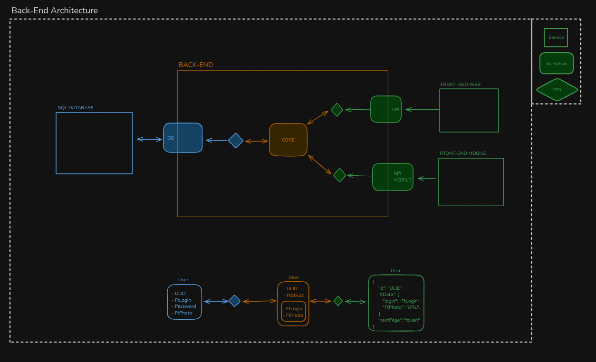

# Backend — Pan Bagnat

This document explains the backend stack, how to run it locally, the clean architecture flow (API ↔ core ↔ database), testing, security, and Swagger.

Contents
- Stack and prerequisites
- Development flow (Clean Architecture)
- Running locally
- Testing
- Security model and middlewares
- Swagger (specs and UI)

## Stack and prerequisites

- Language: Go (go1.21+ recommended)
- Web: chi router (`github.com/go-chi/chi/v5`), CORS (`github.com/go-chi/cors`)
- OAuth: 42 OAuth2 (`golang.org/x/oauth2`)
- DB: PostgreSQL 16+ (see `docker-compose.yml`), SQL + queries in `backend/srcs/database`
- Realtime: WebSocket via gorilla/websocket
- IDs: ULID with type prefix (e.g., `module_01H…`)
- Swagger: generated under `backend/srcs/docs` and served by the backend

Environment variables (local dev):
- See `.env.example` for all values. Key ones:
  - `POSTGRES_URL` (full DSN for DB access)
  - `HOST_NAME` (used for Swagger host)
  - `FT_CLIENT_ID`, `FT_CLIENT_SECRET`, `FT_CALLBACK_URL` (42 OAuth)
  - `REPO_BASE_PATH` (where module Git repos are cloned; default `../../repos` in dev)

## Development flow (Clean Architecture)

The backend follows a layered flow — keep handlers thin, business logic in `core`, persistence in `database`:

1) API layer (`backend/srcs/api`)
- HTTP routes, request/response DTOs, validation, and mapping.
- Routes are grouped by domain: `modules`, `roles`, `users`, `auth`, `integrations`, `ping`.

2) Core layer (`backend/srcs/core`)
- Business logic and domain models (e.g., `Module`, `Role`, `User`).
- Orchestrates DB calls, Git/Docker operations, and WebSocket events.
- Examples:
  - Modules: import from Git, clone/pull/update remote; Docker config save/deploy; container controls; page proxying.
  - Roles: CRUD, assign to users/modules, rule evaluation against 42 profile; safeguards to avoid removing the last admin.
  - Users: 42 login handling, session issuance, deriving staff/admin flags.

3) Database layer (`backend/srcs/database`)
- SQL queries and scan types; patch/insert helpers.
- Pagination utilities (cursor‑based) with typed orderings.

Data flow example (Get Modules):
HTTP GET `/api/v1/admin/modules` → api/modules → core.GetModules(pagination) → database.GetAllModules(...) → map to DTO and respond.

### Architecture diagram

## Running locally

Option A — Docker (recommended for full stack):
- `make up` brings up `db`, `backend`, `frontend`, `nginx`, and runs migrations.
- App is served via Nginx on ports 80/443 (see `nginx/nginx.conf`).

Option B — Run backend only (dev):
- Ensure the DB is running (Docker `db` or your local Postgres), and set `POSTGRES_URL`.
- `make local-back` runs `go run backend/srcs/main.go` with your `POSTGRES_URL`.
- Swagger UI: http://localhost/api/v1/docs/ (proxied by Nginx) or directly from the backend if you route to port 8080.

Helpful Make targets:
- `make local-back` — run backend locally
- `make test-backend` — run Go tests (see “Testing”)
- `make swagger` — regenerate Swagger specs with updated host
- `make migrate-up` / `migrate-down1` — apply/rollback DB migrations

## Testing

- Backend tests live under `backend/srcs/**_test.go` and use `go test`.
- The Makefile wires `POSTGRES_URL` and runs:
  - `make test-backend` → `cd backend/srcs && POSTGRES_URL=… go test -timeout 30s ./...`
  - `make test-backend-verbose` for `-v` output.
- To add tests: co‑locate `_test.go` files next to the code under test. Prefer focused unit tests per package (core/database) with minimal fixtures.

## Security model and middlewares

AuthN
- 42 OAuth login flow: `/auth/42/login` → `/auth/42/callback` exchanges code for token, then issues a `session_id` cookie.
- Session storage in Postgres (`sessions`), with expiry and per‑device handling.
- `SESSION_COOKIE_DOMAIN` defaults to `.HOST_NAME` so the SPA and every `*.modules.<domain>` host reuse the same session cookie. Override it only if you need a different wildcard. Cookies always use `SameSite=None` to support module iframes.

AuthZ and guards
- `AuthMiddleware`: ensures a valid session; clears cookie if expired.
- `AdminMiddleware`: restricts `/api/v1/admin/*` to users with the `roles_admin` role.
- `BlackListMiddleware`: if a user has `roles_blacklist`, all sessions are revoked and access is denied (403).

Cookies & CORS
- `session_id` is set with appropriate `Secure` flag depending on TLS headers (via Nginx `X-Forwarded-Proto`).
- CORS is restricted to `http(s)://$HOST_NAME` and allows credentials.
- Login redirection carries a short-lived `pb_login_next` cookie. `/auth/42/login?next=<url>` sets that cookie (domain follows `SESSION_COOKIE_DOMAIN`), the OAuth callback consumes it, validates the target host against `MODULES_IFRAME_ALLOWED_HOSTS` + `MODULES_PROXY_ALLOWED_DOMAINS`, and performs a 303 redirect if the URL is trusted. This is what enables opening a module directly on `slug.modules.<domain>` and landing back there after authenticating.

Realtime & Webhooks
- WebSocket endpoint `/ws` with per‑module subscriptions.
- Webhook `/webhooks/events` (HMAC signed) fans‑out events to subscribers.

Module proxy integration
- Module pages now declare a container name + port instead of a raw URL (`module_page.target_container` / `target_port`) along with `network_name`, `iframe_only`, and `need_auth`.
- `/api/v1/modules/pages/{slug}/session` issues an HMAC-signed token that the frontend trades for a module specific cookie by calling `<module-origin>/_pb/session`. Tokens expire quickly (`MODULES_SESSION_TOKEN_TTL`) and are bound to the user session ID.
- `MODULES_PROXY_ALLOWED_DOMAINS` and `MODULES_IFRAME_ALLOWED_HOSTS` default to `modules.HOST_NAME` and `HOST_NAME` respectively so both sides agree on valid hosts/suffixes; override them to allow additional domains.
- `MODULES_LOGIN_URL` (served by the frontend) falls back to `https://HOST_NAME/login` and is where unauthenticated module requests are redirected; the backend advertises the same URL to `proxy-service`.

## Swagger (specs and UI)

The backend serves three filtered Swagger JSON specs and one UI:
- `/api/swagger.json` — full spec (internal, includes both public and admin endpoints)
- `/api/swagger-public.json` — public slice (filters out `/admin/*`)
- `/api/swagger-admin.json` — admin slice (only `/admin/*`)
- Swagger UI served at `/api/v1/docs/` (static files from `backend/srcs/docs/swagger-ui`)

Regenerating the spec for your host:
- `make swagger` (sets host to `HOST_NAME` in the generated files)

—
Back to root: ../README.md
